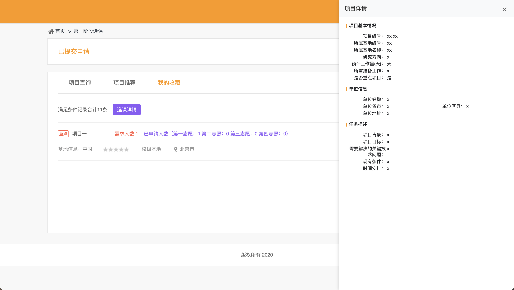

# 清华研究生社会实践系统增强插件

  

## 功能

### 1. 侧边栏查看详情
点击项目标题，详情页在右侧侧边栏展示，无需跳转新页面。

### 2. 收藏页面选课详情
在"我的收藏"页面，点击"选课详情"按钮，查看各志愿申请人数。

## 安装

1. Chrome 浏览器打开 `chrome://extensions/`
2. 开启"开发者模式"
3. 点击"加载已解压的扩展程序"
4. 选择 `extension` 目录

## 展示

