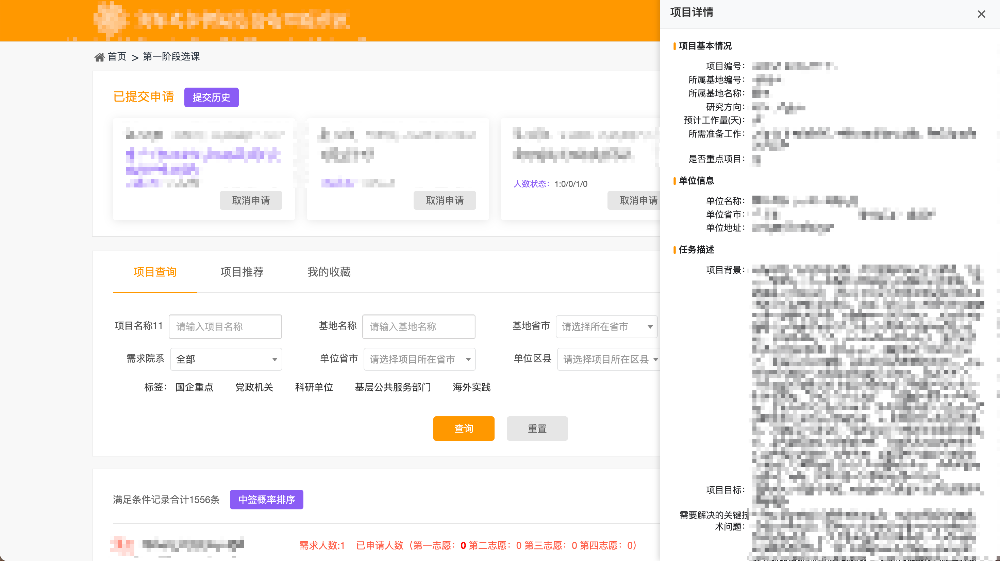

# 清华研究生社会实践系统增强插件

## 功能

1. 新详情页跳转改进成内嵌侧边栏
2. 收藏页面增加查询已选人数情况
3. 已提交申请增加显示详情和已选人数情况
4. 项目查询页面支持中签概率排序
5. 支持查看提交历史

## 安装

1. Chrome 浏览器打开 `chrome://extensions/`
2. 开启"开发者模式"
3. 点击"加载已解压的扩展程序"
4. 选择 `extension` 目录

## 展示

